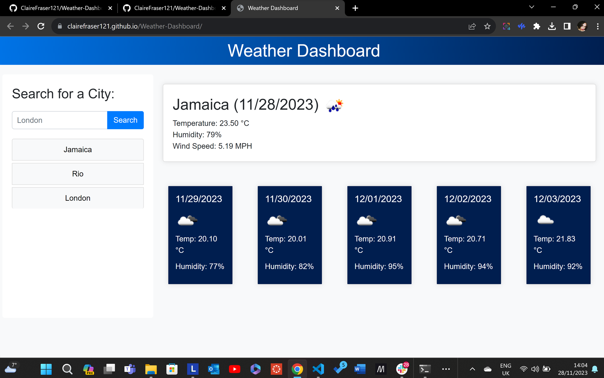

# Weather Dashboard

## Description

The Weather Dashboard is a user-friendly web application designed to provide real-time weather information for cities around the world. With a sleek and intuitive interface, users can easily access current weather conditions and a 5-day forecast for any desired location.

### Key Features

- **Search Functionality:** Users can enter the name of a city in the search bar and receive instant weather updates.
  
- **Responsive Design:** The app is designed to be responsive, ensuring a seamless experience across various devices, including desktops, tablets, and smartphones.

- **Search History:** The dashboard keeps track of search history, allowing users to quickly revisit and compare weather details for previously searched cities.

### Technologies Used

- **OpenWeatherMap API:** Real-time weather data is fetched from the OpenWeatherMap API, providing accurate and up-to-date information.

- **Bootstrap:** The front-end design is built using Bootstrap, ensuring a clean and modern layout that is both visually appealing and user-friendly.

- **Day.js:** JavaScript date library used to handle and format date and time information.

## Instructions

1. Enter the name of a city in the search bar.
2. Click the "Search" button.
3. View the current weather and 5-day forecast for the entered city.
4. Click on a city in the search history to quickly view its weather.

## Usage

The Weather Dashboard is perfect for:

- Checking the current weather conditions before heading out.
- Planning upcoming trips and vacations.
- Monitoring the weather in multiple cities for business or personal reasons.

## Screenshots

## Demo

<https://clairefraser121.github.io/Weather-Dashboard/>

<https://github.com/ClaireFraser121/Weather-Dashboard>

## Credits

- [OpenWeatherMap](https://openweathermap.org/) - Weather data API.
- [Bootstrap](https://getbootstrap.com/) - Front-end framework.
- [Day.js](https://day.js.org/) - JavaScript date library.

## License

This project is licensed under the [MIT License](LICENSE).

## Badges

## Conclusion

Thank you for exploring the Weather Dashboard app! If you have any questions or feedback, feel free to [contact us](mailto:your-email@example.com).
